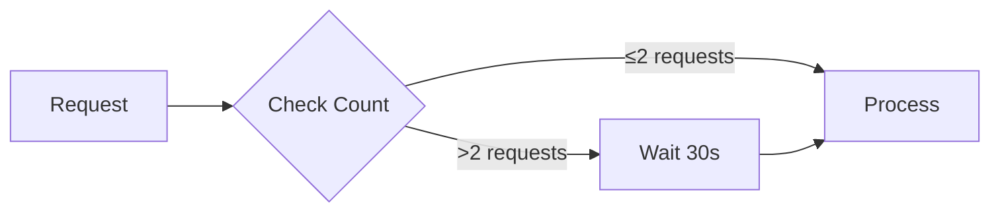

# 📑 Web Page to PDF Automation


> 🚀 Automate webpage-to-PDF conversion with ease! Perfect for batch downloading and archiving web content.

## ✨ Features

🔄 **Automated Conversion**
- One-click webpage to PDF transformation
- Intelligent rate limiting
- Sequential file naming

🎯 **Smart Processing**
- Headless browser operation
- Built-in wait times
- Custom directory management

🛡️ **Reliability**
- Error handling
- Folder auto-creation
- Clean browser termination

## 🚀 Quick Start

### Prerequisites

Before you begin, ensure you have:

- 🐍 Python 3.x installed
- 🦁 Brave Browser
- 🔧 Chrome WebDriver
- 📦 Required packages

### 🔧 Installation

1️⃣ **Clone & Navigate**
```bash
git clone https://github.com/anasskhannn/Web-Automation-With-Selenium
cd Web-Automation-With-Selenium
```

2️⃣ **Install Dependencies**
```bash
pip install selenium
```

3️⃣ **Configure**
```python
brave_path = "Your Browser Path Here"
chromedriver_path = "Your Chrome Drivers Path Here"
output_folder = "Download Directory"
```

## 📚 Usage Guide

### Basic Usage

1. Configure your paths:
```python
# In download_pdf.py
brave_path = "C:/Program Files/BraveSoftware/Brave-Browser/Application/brave.exe"
chromedriver_path = "path/to/chromedriver.exe"
output_folder = "PDFs"
```

2. Run the script:
```bash
python download_pdf.py
```

3. Enter page count when prompted ✨

### 🎨 Customization Options

Tailor the PDF output to your needs:

```python
print_params = {
    "landscape": False,           # 📄 Page orientation
    "displayHeaderFooter": False, # 👆 Header/footer visibility
    "printBackground": True,      # 🎨 Background graphics
    "preferCSSPageSize": True,    # 📏 Page sizing
}
```

## 🔒 Rate Limiting Protection

Our smart rate limiting ensures responsible automation:



## 📁 Output Structure

Your PDFs will be organized as:
```
Download Directory/
├── 📄 1.pdf
├── 📄 2.pdf
├── 📄 3.pdf
└── ...
```

## 🛡️ Error Handling

The script includes robust error handling:
- ✅ Directory creation checking
- ⏳ Page load verification
- 🧹 Resource cleanup

## 🤝 Contributing

We welcome contributions! Here's how you can help:

1. 🍴 Fork the repository
2. 🔧 Create your feature branch
3. 💪 Make your changes
4. 📤 Submit a pull request


## 📝 Notes

### Best Practices
- 🏃‍♂️ Script runs headless for optimal performance
- 📂 Verify output directory permissions
- ⚡ Adjust timers for your needs

### Tips for Success
- 🎯 Test with small page counts first
- 📊 Monitor system resources
- 🔄 Regular WebDriver updates

---

<div align="center">

**Made with ❤️by Mohd Anas Khan**

</div>
